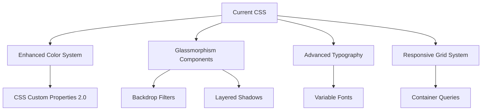
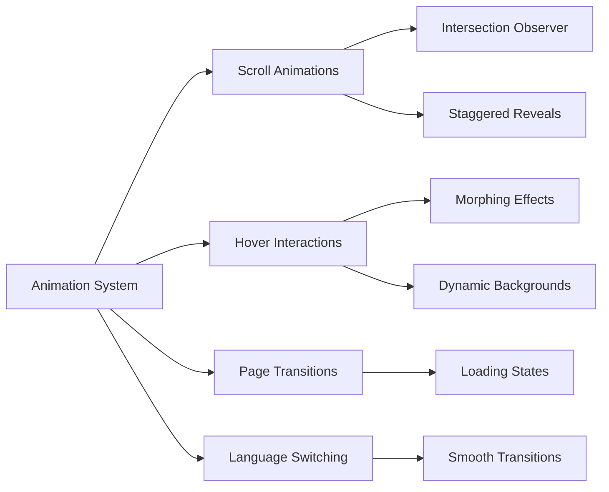
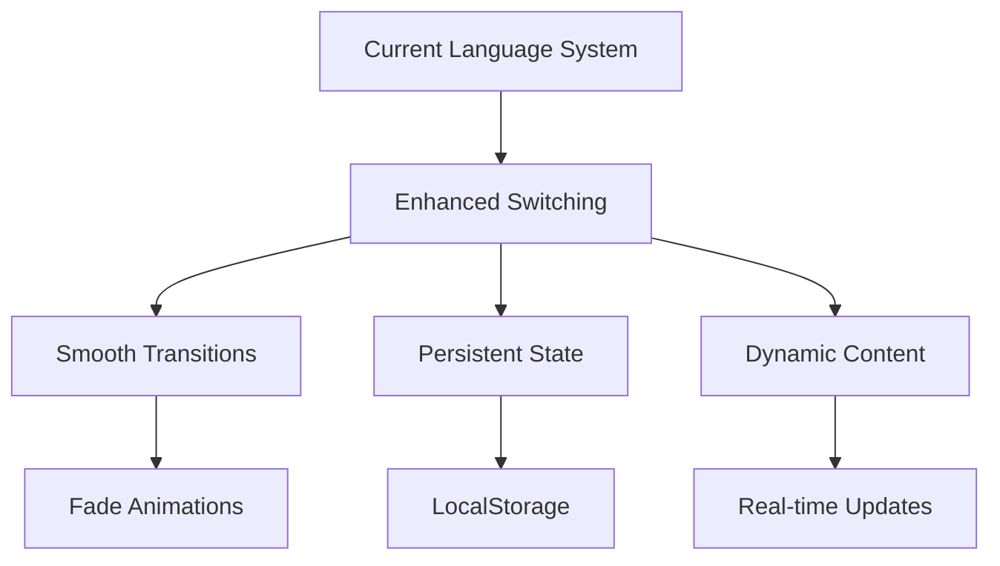

# 🎨 Quality Pro Canada - Modern Glassmorphism Redesign Plan

## 📋 Project Overview
Transform your existing GitHub Pages website into a stunning, modern glassmorphism-styled portfolio with comprehensive animations and enhanced bilingual support.

## 🎯 Design Direction: Glassmorphism + Comprehensive Animations

### Core Visual Elements
- **Frosted glass effects** with backdrop-filter blur
- **Translucent cards** with subtle borders and soft shadows
- **Floating elements** with depth and layering
- **Soft color palettes** with gradient overlays
- **Smooth micro-interactions** throughout the user journey

## 🔧 Technical Enhancement Plan

### 1. **Advanced Styling System**



**Enhancements:**
- Extended CSS custom properties with glassmorphism variables
- Advanced gradient systems with multiple layers
- Sophisticated shadow and blur effects
- Enhanced typography with variable font weights
- Modern spacing and sizing systems

### 2. **Comprehensive Animation Framework**



**Features:**
- **Scroll-triggered animations**: Elements fade, slide, and scale into view
- **Staggered reveals**: Cards and sections animate in sequence
- **Hover micro-interactions**: Buttons, cards, and icons respond dynamically
- **Morphing shapes**: Background elements that transform on interaction
- **Loading animations**: Skeleton screens and progressive loading
- **Language switching**: Smooth transitions between French and English

### 3. **Enhanced Bilingual System**



**Improvements:**
- Animated language transitions with fade effects
- Persistent language preference using localStorage
- Enhanced language toggle with visual feedback
- Smooth content morphing during language changes

### 4. **Glassmorphism Component Library**

#### Navigation Bar
- Frosted glass background with blur effect
- Floating appearance with subtle border
- Dynamic shadow based on scroll position
- Animated language toggle button

#### Hero Section
- Layered glass panels with depth
- Floating call-to-action button
- Animated background particles
- Gradient overlays with transparency

#### Service Cards
- Translucent backgrounds with soft borders
- Hover effects with increased blur and glow
- Staggered animation on scroll
- Interactive icon animations

#### Contact Form
- Glass-style input fields
- Floating labels with smooth transitions
- Submit button with ripple effects
- Form validation with animated feedback

### 5. **Advanced Interactive Features**

#### Micro-Interactions
- Button hover states with morphing effects
- Icon animations on interaction
- Smooth page scrolling with easing
- Dynamic cursor effects

#### Loading & Transitions
- Page load animations with skeleton screens
- Section transitions with blur effects
- Image lazy loading with fade-in
- Smooth navigation between sections

## 📱 Mobile-First Enhancements

### Responsive Glassmorphism
- Adaptive blur effects for mobile performance
- Touch-optimized interactions
- Swipe gestures for language switching
- Mobile-specific animation optimizations

### Performance Considerations
- CSS-only animations where possible
- Reduced motion preferences support
- Optimized backdrop-filter usage
- Progressive enhancement approach

## 🎨 Color Palette & Visual System

### Primary Glassmorphism Colors
- **Glass Base**: `rgba(255, 255, 255, 0.1)`
- **Glass Border**: `rgba(255, 255, 255, 0.2)`
- **Shadow Soft**: `rgba(0, 0, 0, 0.1)`
- **Backdrop Blur**: `blur(20px)`

### Enhanced Gradients
- **Primary**: `linear-gradient(135deg, rgba(99, 102, 241, 0.8), rgba(139, 92, 246, 0.8))`
- **Secondary**: `linear-gradient(135deg, rgba(59, 130, 246, 0.6), rgba(37, 99, 235, 0.6))`
- **Accent**: `linear-gradient(135deg, rgba(16, 185, 129, 0.4), rgba(5, 150, 105, 0.4))`

### Typography System
- **Primary Font**: Inter Variable (Google Fonts)
- **Heading Weights**: 300, 400, 600, 700, 800
- **Body Weights**: 300, 400, 500
- **Font Sizes**: Fluid typography with clamp() functions

## 📁 File Structure Plan

```
qualitypro/
├── index.html (enhanced with new structure)
├── style.css (completely modernized)
├── scripts.js (comprehensive animation system)
├── assets/
│   ├── animations.css (dedicated animation library)
│   └── glassmorphism.css (glassmorphism components)
└── MODERNIZATION_PLAN.md (this document)
```

## 🚀 Implementation Phases

### Phase 1: Core Glassmorphism Styling
- Implement base glassmorphism design system
- Update color palette and typography
- Create reusable glass components
- Enhance CSS custom properties

### Phase 2: Animation Framework
- Build comprehensive animation system
- Implement scroll-triggered animations
- Add hover and interaction effects
- Create loading states and transitions

### Phase 3: Enhanced Bilingual System
- Improve language switching with animations
- Add persistent language preferences
- Optimize content transitions
- Enhance accessibility features

### Phase 4: Mobile Optimization & Polish
- Fine-tune mobile experience
- Performance optimization
- Cross-browser testing and fixes
- Final polish and refinements

## 🎯 Expected Outcomes

### Visual Impact
- ✨ Modern, professional glassmorphism aesthetic
- 🎭 Engaging animations and micro-interactions
- 📱 Seamless responsive experience
- 🌍 Smooth bilingual functionality

### Technical Benefits
- ⚡ Improved performance with optimized animations
- 🔧 Maintainable, modular CSS architecture
- 📊 Enhanced user engagement metrics
- 🎨 Future-proof design system

### User Experience
- 🎪 Delightful interactions throughout the journey
- 🌐 Effortless language switching
- 📖 Clear, accessible content presentation
- 🎯 Professional, trustworthy brand impression

## 🔍 Key Features to Implement

### 1. **Glassmorphism Elements**
- [ ] Frosted glass navigation bar
- [ ] Translucent service cards
- [ ] Glass-style contact form
- [ ] Floating hero elements
- [ ] Layered background effects

### 2. **Animation System**
- [ ] Scroll-triggered reveals
- [ ] Staggered card animations
- [ ] Hover micro-interactions
- [ ] Loading animations
- [ ] Page transitions

### 3. **Enhanced Bilingual Support**
- [ ] Smooth language transitions
- [ ] Persistent language preference
- [ ] Animated toggle button
- [ ] Content morphing effects

### 4. **Performance Optimizations**
- [ ] Reduced motion support
- [ ] Mobile-optimized animations
- [ ] Lazy loading implementation
- [ ] Progressive enhancement

### 5. **Interactive Features**
- [ ] Dynamic cursor effects
- [ ] Ripple button effects
- [ ] Floating label forms
- [ ] Particle background system

---

## 📝 Implementation Notes

This comprehensive plan will transform the Quality Pro Canada website into a cutting-edge, glassmorphism-styled portfolio that perfectly represents expertise in quality engineering while providing an exceptional user experience in both French and English.

The implementation will focus on:
1. **Visual Excellence**: Modern glassmorphism design with sophisticated effects
2. **Smooth Animations**: Comprehensive animation system with micro-interactions
3. **Bilingual Enhancement**: Improved language switching with smooth transitions
4. **Performance**: Optimized for all devices and connection speeds
5. **Accessibility**: Ensuring the site works for all users

**Next Steps**: Switch to Code mode for implementation of this modernization plan.